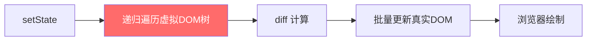
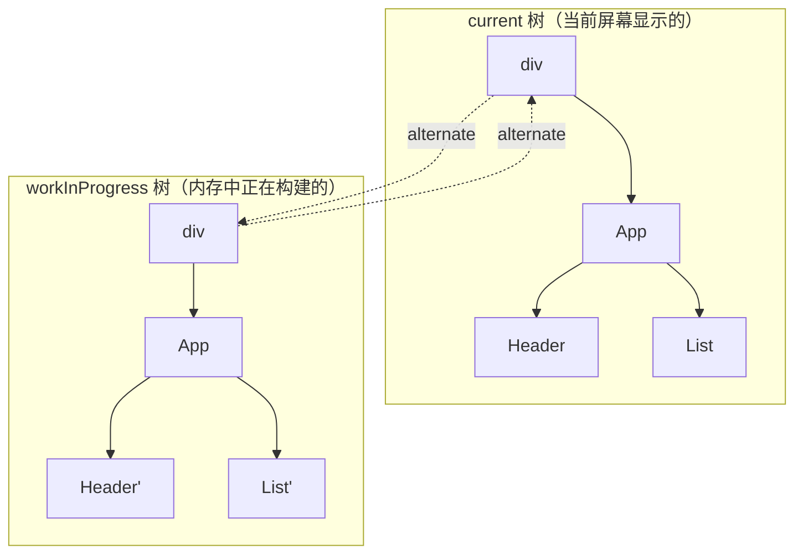
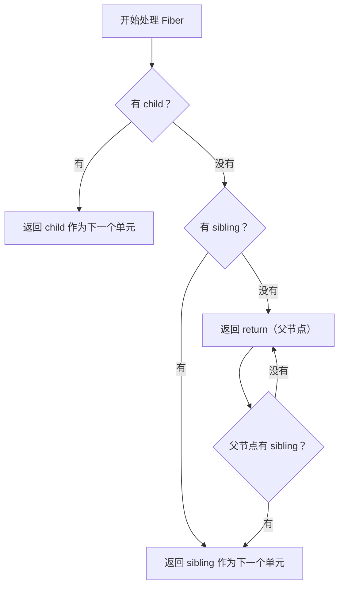
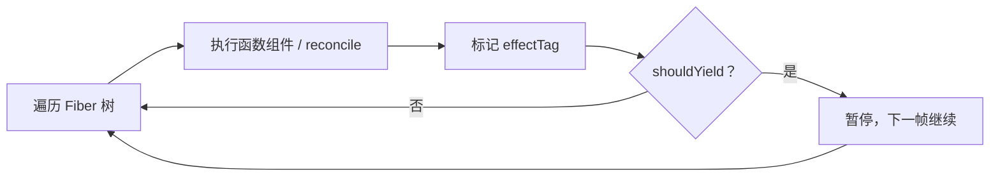
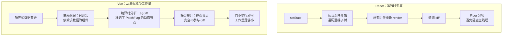

## React 15 的性能瓶颈：Stack Reconciler

在理解 Fiber 之前，需要先了解它要解决什么问题。

React 15 使用的是 **Stack Reconciler**（栈调和器）。当组件状态变更时，React 会从根组件开始，递归地遍历整棵虚拟 DOM 树，找出差异（diff），然后一次性更新真实 DOM。这个过程是**同步且不可中断**的：



标红的部分就是问题所在：**递归遍历是一口气跑完的，中间不会停**。

对于大多数应用这没问题。但如果虚拟 DOM 树非常大（比如几千个节点），递归 diff 可能需要几十甚至上百毫秒。而浏览器每帧只有约 16.6ms（60fps），一旦 JS 执行超过这个时间，就会掉帧——用户看到的就是页面卡顿、动画掉帧、输入无响应。

更糟糕的是，这期间浏览器无法响应用户事件（点击、输入、滚动），因为 JS 是单线程的，递归调用栈没跑完之前，事件循环无法处理其他任务。

```mermaid
gantt
    title 一帧的时间线（Stack Reconciler）
    dateFormat X
    axisFormat %L

    section 主线程
    JS 递归 diff（阻塞）    :0, 50
    浏览器无法响应事件      :0, 50
    样式计算 + 布局         :50, 55
    绘制                    :55, 60

    section 浏览器期望
    每帧 16.6ms            :crit, 0, 17
    掉帧！                  :crit, 17, 50
```



**核心矛盾**：渲染工作是同步的、不可中断的，而用户交互需要主线程及时响应。

---

## Fiber 的核心思想：可中断的渲染

React Fiber 的本质是**将同步的递归渲染改造为异步的、可中断的增量渲染**。

### Fiber 节点

在 Fiber 架构中，每个 React 元素对应一个 **Fiber 节点**，这些节点通过链表结构（而非递归调用栈）组织成一棵树：

```typescript
interface Fiber {
    // 静态结构
    type: any;              // 对应的组件类型（div、App、function...）
    key: string | null;
    props: any;

    // 链表关系（替代递归调用栈）
    return: Fiber | null;   // 父节点
    child: Fiber | null;    // 第一个子节点
    sibling: Fiber | null;  // 下一个兄弟节点

    // 副作用
    effectTag: number;      // 标记需要执行的操作（插入、更新、删除...）
    alternate: Fiber | null; // 指向上一次渲染的 Fiber（双缓冲）

    // 优先级
    lanes: number;          // 该节点的优先级标记
}
```

链表结构的妙处在于：**它天然支持从任意节点暂停和恢复**。递归调用栈做不到这一点——一旦进入递归，只能等所有子调用返回后才能回到上一层。而链表只需记住"当前处理到哪个节点"，就能随时暂停、随时恢复。

### 双缓冲：current 树与 workInProgress 树

React 维护了两棵 Fiber 树：



- **current 树**：当前屏幕上显示的内容对应的 Fiber 树
- **workInProgress 树**：正在内存中构建的新 Fiber 树

每个 Fiber 节点的 `alternate` 属性指向另一棵树中的对应节点。当 workInProgress 树构建完成后，React 只需将指针从 current 树切换到 workInProgress 树，屏幕就更新了——这就是"双缓冲"。

### 工作循环：Fiber 的调度引擎

Fiber 的核心是一个工作循环（work loop），伪代码如下：

```typescript
function workLoop() {
    // 当前还有工作要做，且当前帧还有剩余时间
    while (nextUnitOfWork && !shouldYield()) {
        // 执行一个工作单元，返回下一个工作单元
        nextUnitOfWork = performUnitOfWork(nextUnitOfWork);
    }

    if (nextUnitOfWork) {
        // 还有工作没做完，但时间到了，让出主线程
        // 下一帧继续
        requestIdleCallback(workLoop);
    } else {
        // 所有工作完成，提交更新
        commitRoot();
    }
}
```

关键在于 `shouldYield()`——它检查当前帧是否还有剩余时间：

```typescript
function shouldYield(): boolean {
    const currentTime = performance.now();
    const deadline = getCurrentDeadline(); // 当前帧的截止时间
    return currentTime >= deadline;
}
```



```mermaid
gantt
    title 一帧的时间线（Fiber）
    dateFormat X
    axisFormat %L

    section 主线程
    Fiber 工作单元 1    :0, 4
    Fiber 工作单元 2    :4, 8
    Fiber 工作单元 3    :8, 12
    shouldYield() → true :12, 13
    让出主线程          :13, 14
    样式计算 + 布局     :14, 15
    绘制               :15, 17

    section 下一帧
    Fiber 工作单元 4    :17, 21
    Fiber 工作单元 5    :21, 25
    commit 提交更新     :25, 28
```

对比 Stack Reconciler，Fiber 将一整块工作拆成了多个小单元，在每一帧中只执行一部分，剩余时间留给浏览器做渲染和响应用户事件。

### performUnitOfWork：深度优先遍历链表

单个工作单元的处理遵循深度优先的顺序，但通过链表实现而非递归：



用代码表达：

```typescript
function performUnitOfWork(fiber: Fiber): Fiber | null {
    // 1. 处理当前 fiber（执行组件函数、diff 子节点）
    const children = reconcileChildren(fiber);

    // 2. 优先返回 child（深度优先）
    if (fiber.child) return fiber.child;

    // 3. 没有 child，找 sibling
    let nextFiber = fiber;
    while (nextFiber) {
        if (nextFiber.sibling) return nextFiber.sibling;
        nextFiber = nextFiber.return; // 回到父节点继续找
    }

    return null; // 全部遍历完毕
}
```

---

## 两阶段提交：Render 与 Commit

Fiber 将一次更新分为两个阶段：

### Phase 1：Render 阶段（可中断）

遍历 Fiber 树，执行组件函数、计算 diff、标记副作用（`effectTag`）。这个阶段是**纯计算，不操作 DOM**，因此可以安全地中断和恢复。



### Phase 2：Commit 阶段（不可中断）

将 Render 阶段收集的所有副作用一次性应用到真实 DOM。这个阶段是**同步的、不可中断的**，因为中间状态不能被用户看到（DOM 更新了一半的页面是不完整的）。

```typescript
function commitRoot() {
    // 遍历 effectList，执行 DOM 操作
    effectList.forEach(fiber => {
        switch (fiber.effectTag) {
            case 'PLACEMENT':  appendDomElement(fiber); break;
            case 'UPDATE':     updateDomElement(fiber); break;
            case 'DELETION':   removeDomElement(fiber); break;
        }
    });
}
```

### 为什么必须分两阶段？

因为 Render 阶段可能被中断、恢复、甚至丢弃（如果有更高优先级的更新到来）。如果 Render 阶段就操作 DOM，那么中断后再恢复时，DOM 可能处于不一致的中间状态。两阶段提交保证了：**要么全部更新，要么完全不更新**。

---

## 优先级与 Lane 模型

Fiber 还引入了优先级调度的概念。不同类型的更新有不同的紧急程度：

| 优先级 | 场景 | 用户感知 |
|--------|------|---------|
| 同步（最高） | 用户输入、点击 | 不立即响应会明显卡顿 |
| 高 | 受控输入框的值同步 | 输入延迟难以忍受 |
| 中 | 数据加载完成后更新列表 | 可以稍等 |
| 低 | 离屏内容预渲染 | 完全无感知 |
| 空闲 | 分析数据上报 | 可随时被抢占 |

React 使用 **Lane 模型**（React 17+ 引入，替代了之前的 expirationTime 模型）来管理优先级。Lane 是一个 31 位的二进制数，每一位代表一个优先级通道：

```typescript
const SyncLane =        0b0000000000000000000000000000001;  // 同步
const InputContinuousLane = 0b0000000000000000000000000000100;  // 连续输入
const DefaultLane =     0b0000000000000000000000000010000;  // 默认
const IdleLane =        0b0010000000000000000000000000000;  // 空闲
```

当高优先级更新到来时，React 会**中断**当前正在进行的低优先级渲染，转而处理高优先级更新。处理完后再恢复低优先级工作——或者如果低优先级的工作已经过期（stale），直接丢弃重新计算。

---

## 与 Vue 的对比：为什么 Vue 不需要 Fiber？

一个常见的面试问题：**Vue 为什么不需要 Fiber？**

要回答这个问题，需要先理解两者在更新粒度上的根本差异。

### 更新粒度：组件级 vs 绑定级

React 的更新粒度是**组件级**。一个 `setState` 触发后，从该组件开始，整棵子树都会重新执行 render 函数。即使某个子组件的 props 没变，React 也需要遍历到它才能确认（除非开发者手动用 `React.memo` 包裹）。

Vue 的更新粒度是**具体的响应式绑定级**。编译器在构建阶段就已经通过静态分析知道模板中哪些节点是动态的（PatchFlags），响应式系统也精确追踪了哪些数据被哪些渲染依赖。一次状态更新只会触发真正依赖它的那几个 DOM 操作，不需要遍历整棵树。

打个比方：

- **React**：有人摁门铃，你需要挨个敲所有房间的门问"你需要响应吗？"
- **Vue**：门铃直接连到了对应房间的灯上，只有那个房间会亮

### Vue 的三重优化

Vue 通过三个层面的优化，将每次更新需要做的工作量压到了足够小：



| 优化层面 | 具体机制 | 效果 |
|----------|---------|------|
| **响应式依赖追踪** | `Proxy` + `track`/`trigger`，精确记录"谁用了谁" | 只通知真正依赖变更数据的组件 |
| **编译时 PatchFlags** | 模板编译时标记动态绑定类型（TEXT、CLASS、PROPS 等） | diff 时只比较动态部分，跳过静态节点 |
| **静态提升（Static Hoisting）** | 纯静态子树只创建一次，提升到 render 函数外部 | 每次更新零开销，连比较都不需要 |

综合起来，Vue 中一次典型的状态更新，实际工作量可能只有 React 的十分之一甚至更少，因此**同步执行也不会构成阻塞主线程的"长任务"**。

### 对比总结

| 维度 | React Fiber | Vue 3 |
|------|------------|-------|
| 更新粒度 | 组件级（整棵子树） | 响应式绑定级（精确到具体 DOM 操作） |
| 优化重心 | 运行时：可中断调度，兜底所有情况 | 编译时 + 响应式：从源头减少工作量 |
| diff 范围 | 整棵虚拟 DOM 树（但可分帧） | 仅动态绑定节点（PatchFlags） |
| 静态内容 | 每次渲染仍然遍历 | 编译时提升，完全不参与 diff |
| 调度模型 | 优先级抢占式调度 | 微任务批处理（`nextTick`） |
| 可中断性 | Render 阶段可中断 | 不可中断，但工作量更小 |
| 极端情况表现 | Fiber 分帧扛住 | 没有分帧机制，可能卡顿 |

### 本质是工程权衡，不是绝对优劣

Evan You（Vue 作者）在 2018 年的设计文档中明确说过：

> Vue 的策略是通过模板编译时的静态分析和细粒度响应式依赖追踪，让绝大多数更新都足够快，从而不需要时间切片。但如果真的遇到超大量的 DOM 操作，Vue 目前也没有 Fiber 这样的机制来保证不卡顿。

两种思路各有取舍：

- **Vue**：在绝大多数业务场景下更简单高效，但承认极端情况（如 `v-for` 同时更新数万条复杂数据）可能掉帧
- **React**：在任何情况下都有分帧兜底，但代价是运行时复杂度和内存开销（双缓冲 Fiber 树、调度器）

一言以蔽之：**React 选择"让大任务变得可中断"，Vue 选择"让任务根本不大"。**

---

## 面试常见问题速查

### 1. Fiber 是什么？

Fiber 是 React 16 引入的新的协调引擎。它将虚拟 DOM 节点从嵌套的 JavaScript 对象改造为带有链表关系的 Fiber 节点，使得渲染过程可以被拆分为多个小的工作单元，支持可中断、可恢复的异步渲染。

### 2. Fiber 是怎么实现可中断的？

- **链表结构替代递归**：Fiber 节点通过 `child`、`sibling`、`return` 组成链表，可以从任意节点暂停和恢复
- **工作循环 + shouldYield**：每处理完一个 Fiber 节点，检查当前帧是否还有剩余时间，没有就暂停
- **两阶段提交**：Render 阶段（可中断、纯计算）和 Commit 阶段（不可中断、操作 DOM）

### 3. 为什么不能在 Render 阶段操作 DOM？

因为 Render 阶段可中断。如果中途操作了 DOM，再恢复时 DOM 处于不一致的中间状态，用户会看到不完整的 UI。两阶段提交保证了原子性。

### 4. Fiber 和 requestIdleCallback 是什么关系？

React 早期确实使用 `requestIdleCallback` 来实现帧剩余时间检测。但后来发现 `requestIdleCallback` 的兼容性和帧率表现不够好，React 团队自己实现了一个调度器包 `scheduler`，内部使用 `MessageChannel` + `performance.now()` 来模拟类似的能力。

### 5. React 18 的并发模式（Concurrent Mode）和 Fiber 的关系？

Fiber 是底层架构，Concurrent Mode 是基于 Fiber 架构暴露给开发者的上层 API。React 18 中的 `useTransition`、`useDeferredValue`、`Suspense` 等特性，底层都依赖 Fiber 的可中断调度能力。
