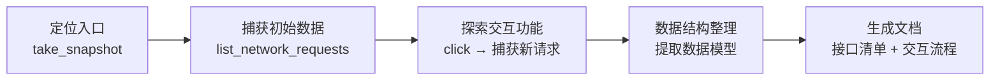

Vibe Coding 这个词在 2025 年被 Andrej Karpathy 提出后迅速火遍技术圈。很多人对它的理解停留在"用自然语言让 AI 写代码"——打开一个对话框，说"帮我写个流程管理模块"，然后复制粘贴。

本文不讲这些。本文记录的是我在一个企业级项目中全权使用 Vibe Coding 开发两个月后，从错误的实践中逐步摸索到正确流程的试错过程。

---

## 一、先搞清楚几个概念

很多人把"用 AI 写代码"笼统地称为 Vibe Coding，但这里面有清晰的分层：

```
┌──────────────────────────────────────────────────────────┐
│              Skill 层                                     │
│   渐进式披露的标准工作流：业务分析、代码审查、设计规范检查   │
│   → 拓展 LLM 的能力边界，标准格式利于分发和复用             │
├──────────────────────────────────────────────────────────┤
│              Agent 层                                     │
│   具有完整行动能力的人：编排工具、管理上下文、自主决策       │
├──────────────────────────────────────────────────────────┤
│              MCP 层                                       │
│   Model Context Protocol：标准化工具协议                   │
│   → 让 LLM 能调用浏览器、文件系统、终端等外部工具           │
│   → 拓展 LLM 的行动边界                                   │
├──────────────────────────────────────────────────────────┤
│              LLM 层                                       │
│   大脑：Claude / GPT - 理解意图、生成代码、推理问题         │
└──────────────────────────────────────────────────────────┘
```

- **LLM**：整个体系的"大脑"。理解语言、推理问题、生成代码。但它本身只是一个驻留在数据中心的推理引擎，没有手脚，触碰不到外部世界
- **Agent**：给大脑装上了手脚和行动能力的"人"。同样是 LLM，装在 Agent 框架里就从"问答机器人"变成了"能干活的助手"
- **MCP**：一种模型上下文协议，定义了 LLM 调用外部工具的标准接口。本质上是在**拓展 LLM 的行动边界**——没有 MCP 只能处理文本，有了 MCP 能操作浏览器、文件系统、终端
- **Skill**：一种**渐进式披露**的标准。把特定领域的最佳实践封装为结构化工作流，按需注入 LLM 上下文。和 MCP 一样在拓展边界，但 Skill 的形式更利于**分发**——你可以把"业务逻辑分析"这个 Skill 分享给任何开发者，他们加载后 Agent 就自动具备了系统分析 Web 应用的能力

打个比方：LLM 是一个极其聪明但被困在玻璃罐里的大脑。MCP 是在玻璃罐上凿出的通道，让大脑能伸手操作外面的工具。Skill 是给大脑注入的领域经验，让它在特定任务上表现得像专家。Agent 是把这三者组装在一起的完整"人"。

---

## 二、试错阶段一：张嘴就来

项目初期，我的 Vibe Coding 方式非常"纯粹"——直接对着 Agent 说需求：

```
"帮我做一个自定义表格组件"
"给表格加上行内编辑功能"
"加一个缓存管理页面"
```

### 结果：天马行空，完全不是你想要的

你说"帮我做一个自定义表格组件"，Agent 可能生成一个 2000 行的万能组件，内置了你永远用不到的虚拟滚动、树形展开、Excel 导入导出；也可能只给你一个 50 行的骨架，连分页都没有。你说"加一个缓存管理页面"，Agent 凭空编造了一套缓存 API，后端根本不存在这些接口。你说"给表格加上行内编辑"，Agent 用了一种从未见过的状态管理方式，和项目里已有的模式完全不同。

然后你开始纠正——"不对，不要这些功能"、"不对，API 路径不是这样的"、"不对，组件目录应该放在这里"。每次纠正后 Agent 重新生成，但修了 A 又坏了 B，因为 Agent 根本不了解项目的全貌。同一个组件反复修补了六七次，最终结果可能还不如自己从头写。

### 为什么

三个原因：

1. **没有项目级约束，Agent 每次都在猜。** Windows 还是 Linux？反斜杠还是斜杠？路由约定是什么？用了哪个 UI 框架的哪个版本？每次对话都要重新交代，而且 Agent 不一定记得住
2. **没有参考基线，Agent 每次都在创造。** 没有告诉它"参考项目里哪个 CRUD 页面来写"，它就自己从零设计。第一个页面用 Options API，第二个用 Composition API，第三个混着用——十个页面，十种写法
3. **指令太模糊，Agent 每次都在发挥。** "帮我做一个自定义表格组件"——这里面的信息量几乎为零。什么样的表格？多少列？数据从哪来？接口长什么样？Agent 只能用自己的想象力去填，而它的想象力通常和你想要的相去甚远

### 教训

**把 Agent 当"写代码的 ChatGPT"是 Vibe Coding 最大的误区。**

如果你的工作流是"说一句话 → 生成代码 → 发现不对 → 再说一句 → 再生成"，那本质上只是用手动 copy-paste 替代手动打字。Agent 的真正价值在于自主使用工具、多步推理、上下文联动——但这些能力的前提是你给了它足够的约束和框架。

---

## 三、试错阶段二：学会写规矩

经历过阶段一的混乱后，我做了第一件正确的事：给 Agent 建立"项目常识"。

### 做了什么

创建了两个关键文件：

**AGENTS.md**——项目的"宪法"，Agent 进入项目后读取的第一个文件：

```markdown
# Windows 环境配置
用户的操作系统环境是 Windows，你生成的任何内容都应该符合 Windows 环境的标准。
- 使用 PowerShell 命令代替 bash 命令
- 使用 Windows 路径格式（反斜杠 \）

## 项目规则
### ElegantRouter 路由规则
本项目使用 ElegantRouter 管理路由。详细规则请阅读：elegant-router-RULE.md
```

**elegant-router-RULE.md**——路由约定文档，精确描述文件命名、目录结构与路由的对应关系：

```
about/index.vue       → /about (一级路由)
user/[id].vue         → /user/:id (参数路由)
list/home/index.vue   → /list/home (二级路由)
```

### 效果

这两个文件解决的是同一个问题：**消除 Agent 的猜测空间**。

没有 AGENTS.md 时，Agent 可能在 `package.json` 里写 `NODE_ENV=development ...`——Linux 没问题，Windows 直接报错。有了之后，从第一个 commit 开始就是正确的 PowerShell 命令。

没有路由规则文档时，Agent 可能创建 `views/FlowDefinition/List.vue`（PascalCase），但 ElegantRouter 只认 kebab-case，路由注册不上，页面打不开。有了规则文档后，Agent 自动创建 `views/system/flow/definition/list/index.vue`。

### 但还不够

这个阶段解决了"怎么写"的问题，但没解决"写什么"的问题。

路由规则有了，但 Agent 不知道：新页面的数据从哪个接口来，入参出参长什么样，列表展示哪些列，新增表单有哪些字段，应该参考项目里哪个已有页面来写。

结果就是 Agent 仍然在发挥创造力——自己编造 API 路径，自己决定表格列，自己设计表单字段。代码结构正确了，但业务逻辑全是错的。

### 教训

**只约束"怎么写"，不约束"写什么"——这是 Vibe Coding 的第二大误区。**

项目级规则只是地基，Agent 还需要知道具体实现什么、数据长什么样、参考什么模式。这些信息必须来自任务级别的文档。

---

## 四、试错阶段三：文档先行

这是整个方法论的核心转折。我开始在每个功能模块开发前，先写一份精确到文件路径和接口字段的**迁移实施文档**。

### 做了什么

以流程定义模块为例，文档包含：

| 内容 | 作用 |
|------|------|
| 路由结构设计 | Agent 按正确结构创建路由 |
| 三阶段迁移方案 | 大任务拆解为可执行的小步骤 |
| 精确到文件路径的任务清单 | Agent 直接创建对应的文件 |
| API 接口设计（URL、方法、入参、出参） | Agent 按约定规范封装 |
| 数据模型定义 | Agent 生成正确的 TypeScript 类型 |
| 关键复用清单 | 告诉 Agent 参考哪些已有代码 |

任务清单长这样：

| 序号 | 任务 | 文件路径 |
|------|------|----------|
| 1.1 | TypeScript 类型定义 | `src/typings/api/system.api.d.ts` |
| 1.2 | API 服务层 | `src/service/api/system/flow-definition.ts` |
| 1.3 | 路由注册 | `src/router/elegant/routes.ts` |
| 1.4 | 搜索组件 | `src/views/.../definition-search.vue` |
| 1.5 | 列表页 | `src/views/.../definition/list/index.vue` |
| 1.6 | 新增/编辑页面 | `src/views/.../definition/operate/index.vue` |

### 效果

同一个 Agent，能力没变。但阶段一同一个组件修补了 7 次，现在流程定义模块**一次提交就完成了完整的 CRUD 功能**。

差异在于**输入信息的精确度**。告诉 Agent "做一个表格组件"，它需要同时做架构决策、接口设计、UI 设计、状态管理设计——每一步都可能出错。告诉它"创建 `src/service/api/system/flow-definition.ts`，封装以下 7 个接口"，它只需要做一件事：按规范写代码。

这也解释了为什么 Vibe Coding 在迁移类项目中特别有效——你有一个运行的旧系统作为参考，可以精确描述每个功能长什么样，而不是让 Agent 凭空创造。

### 写文档很耗时？

是的，写一份精确的迁移文档可能需要半天到一天。但对比一下：

- **不写文档**：生成 → 不对 → 改 → 再生成 → 还是不对 → 反复 5-7 次 → 每次都消耗上下文
- **写文档**：花半天写 → Agent 一次生成正确结果 → 稍微微调即可

而且文档本身就是项目的知识库。"这个模块为什么这样设计"、"接口字段什么含义"——文档直接可查，不需要翻代码推理。

---

## 五、试错阶段四：让 Agent 自己写文档

阶段三中，迁移文档是人写的——打开旧系统，用开发者工具一个个查看接口，手动记录字段和交互流程。枯燥且容易遗漏。

### 做了什么

我做了一件事：开发了 `business-logic-analysis` Skill，让 Agent 通过 Chrome DevTools MCP 自动分析运行中的源系统。

这个 Skill 定义了五阶段分析流程：



每一步都是通过 MCP 操作真实浏览器。`take_snapshot` 获取页面元素结构，`list_network_requests` 捕获接口调用，`click` 模拟用户操作，`get_network_request` 获取完整的请求/响应数据。

### 产出

Agent 自动产出了这样的分析文档：

```
电子签章-功能分析/
├── 00-概览.md            # 模块概述、功能清单、数据模型
├── 01-签章列表查询/       # URL、方法、入参、出参、示例
├── 02-新增签章/           # 附件上传、保存接口
├── 03-修改签章/           # 详情加载、保存接口
├── 04-删除签章/           # 删除确认、接口调用
├── 05-设置用章人员/       # 人员选择器相关接口
├── 06-查看签章详情/       # WopiFrame 预览
└── 07-搜索筛选/           # 搜索接口参数
```

每份文档包含完整的接口 URL、请求方法、入参出参 JSON 示例、交互流程表格。

### 为什么有效

这形成了一个闭环：

```
Agent 分析旧系统 → 生成文档 → 人审核 → Agent 按文档开发新系统
         ↑                                         |
         └────────── 文档驱动 ←────────────────────┘
```

之前是"人写文档 → Agent 写代码"的单向流程，现在是"Agent 写文档 → 人审核 → Agent 写代码"的闭环。人工介入从"编写"降为"审核"。

还有一个意外收获：**Agent 分析的完整性远超人工**。人手动查看接口时很容易遗漏隐藏的 API 调用（比如页面初始化时默默发了一个获取模板类型的请求），但 Agent 通过 `list_network_requests` 能捕获到每一个 XHR/Fetch 请求，无一遗漏。

### 教训

**只让 Agent 写代码，不让 Agent 做其他事——这是 Vibe Coding 的第三大误区。**

Agent 的能力远不止生成代码。分析、测试、文档生成、代码审查——只要能通过工具完成的任务，Agent 都能做。而你封装的 Skill 就是把这些方法论沉淀为可复用的资产，下个项目直接拿来用。

---

## 六、最终沉淀出的规范流程

经过四个阶段的试错，最终的流程是这样的：

### 步骤一：项目初始化——建立约束

1. 创建 `AGENTS.md`，定义操作系统、路径规范、全局约定
2. 创建技术规范文档，定义路由规则、组件规范、API 封装模式
3. 确认 Agent 能读取到这些文档——问它"本项目的路由规则是什么"

Agent 是无状态的，每次对话不会"记住"上次的约定。这些文档是它唯一能依赖的项目常识。

### 步骤二：功能分析——让 Agent 分析参考系统

如果有可运行的参考系统，用 Skill 让 Agent 自动分析源页面。它会自动捕获页面结构、接口调用、交互流程、数据模型，生成完整的功能分析文档。

人工审核重点：接口参数、枚举值、边界情况。Agent 可能误解某些业务含义，这一步的校准不可省略。

### 步骤三：编写开发文档——精确到文件路径

这一步是文档驱动开发的核心。一份好的开发文档要消除一切歧义：

| 给人看的文档 | 给 Agent 的文档 |
|---|---|
| "列表页展示基本信息" | "列表页展示以下 8 列：模板Id、名称、模板类型..." |
| "使用项目已有的 CRUD 模式" | "参考 `src/views/system/post/`，使用 `useNaivePaginatedTable` hook" |
| "接口按 RESTful 风格" | "GET `/api/flow/definitions`，入参 `page`/`rows`/`searchTitle`，出参 `{ total, rows }`" |

Agent 没有"判断力"，只有"遵循力"。文档越精确，一次通过率越高。

大功能要拆成阶段——第一阶段做列表+CRUD，第二阶段做设计器。每个阶段内的任务精确到文件路径。Agent 的上下文越小，出错概率越低。

### 步骤四：Agent 开发——不要打断

向 Agent 下发指令："根据 `migrate/xxx.md` 文档，开发第一阶段的所有任务。"

然后让它自己跑：读取文档、分析项目结构、创建文件、运行 lint 和 typecheck、自行修复问题。

**不要打断。** 每打断一次，Agent 就要重新加载上下文，效率急剧下降。

### 步骤五：人工验收——精确反馈

检查功能是否完整、交互是否符合预期。

发现问题时，不要说"这个不对"，要说"列表页'是否有分支'列需要支持点击跳转到分支配置页"。反馈越精确，Agent 修复越准确。

如果发现自己频繁打断 Agent 纠正细节，说明开发文档不够精确——应该回去改文档，而不是每次在对话中补丁式纠正。

### 步骤六：发现架构问题就立即重构

在 Vibe Coding 模式下，重构成本极低。你只需要描述意图："把 flow-switch 组件从 views 迁移到 components，抽取 useFlowSwitch hook"——Agent 自动完成移动文件、更新导入、创建 Hook、修改消费方、运行 lint 验证。

传统开发中"有时间再说"的技术债，在 Vibe Coding 里应该"发现就重构"。

---

## 七、不是所有代码都适合交给 Agent

坦诚说，Agent 写不了所有代码。

在我们的项目中，基于 AntV X6 的流程图设计器就是一个反例——拖拽交互、节点连线、属性面板联动，这些复杂的前端交互逻辑，Agent 很难一次写对。三次提交，每次都是"重做"而非"新增"。

对于这类逻辑密集型的交互代码，Agent 更适合作为辅助——人写核心逻辑，Agent 负责外围的胶水代码、类型定义、样式调整。

---

## 八、总结

回顾四个阶段，每一步都是在对"人与 Agent 的边界"做更精确的划分：

| 阶段 | 做法 | 问题 |
|------|------|------|
| 一 | 人下粗指令 → Agent 发挥 | 没有约束，完全混乱 |
| 二 | 人写项目规则 → Agent 遵循 | 结构正确，但业务逻辑是错的 |
| 三 | 人写精确文档 → Agent 按文档开发 | 基本正确，但人写文档成为瓶颈 |
| 四 | Agent 分析旧系统 → 生成文档 → 人审核 → Agent 开发 | 闭环，人的角色从编写者变为审核者和决策者 |

Vibe Coding 的本质不是"让 AI 替你写代码"，而是让你从**代码编写者**转变为**意图描述者 + 质量把控者**。在这个转变中，真正重要的东西变了：

| 传统开发中重要的 | Vibe Coding 中更重要的 |
|---|---|
| 编码能力 | 把模糊需求转化为精确、无歧义的任务描述 |
| 框架熟练度 | 决定模块怎么分、技术方案怎么选 |
| 调试技巧 | "这个不对" vs "这列改为文字点击"之间的差距 |
| 单元测试编写 | 如何在最短时间内判断 Agent 的产出是否正确 |

最后一句实话：Vibe Coding 不是万能的。它最适合有明确参考的开发任务（迁移、增改、模式复制），在从零开始的创造性开发中仍有明显局限。但这个边界正在快速模糊——LLM 在进化，MCP 生态在丰富，Skill 在积累。学会正确的 Vibe Coding 流程，不是为了赶时髦，而是为下一次技术范式转移做准备。
