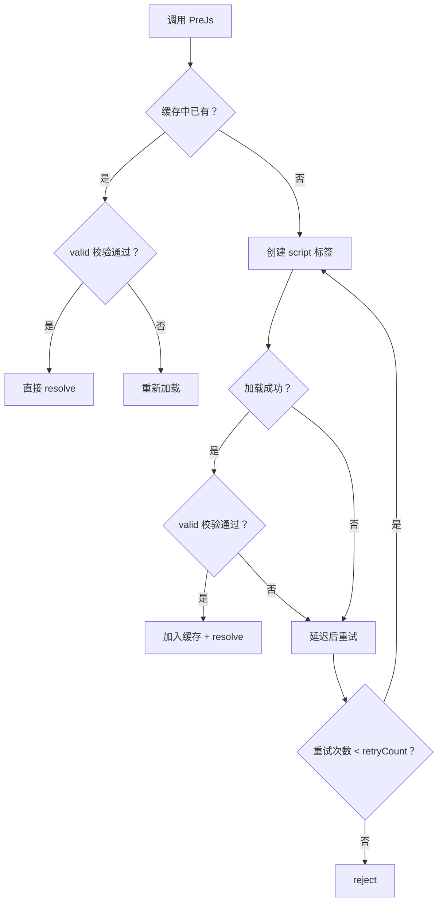
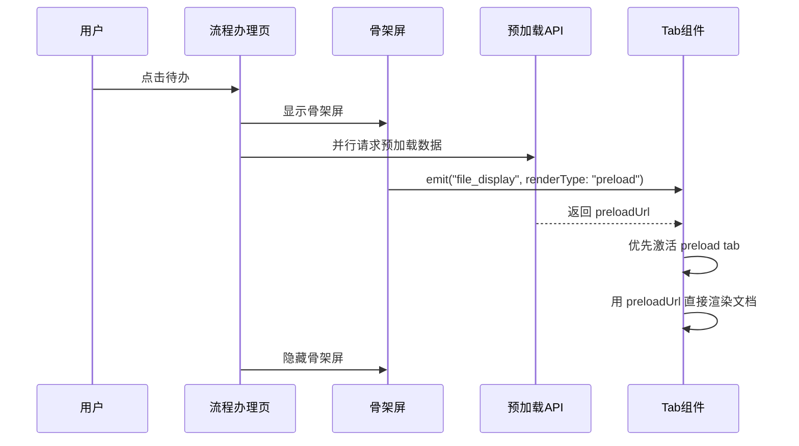

在一个日活数千人的企业级 OA 系统中，性能不是一个可选项，而是系统能否被用户接受的关键因素。审批流程页面的打开速度、工作查询列表的响应时间、流程图的渲染流畅度——每一处延迟都会在用户心中累积成对系统的负面评价。

本文记录了我在 OA 系统项目中实际落地的性能优化工作，涵盖从代码层面的微观优化到架构层面的宏观设计。

---

## 一、JointJS 流程图的分帧渲染

### 问题背景

OA 系统中流程图是一个高频使用的功能模块——查看流程状态、退回、跳转、设置经办人，都依赖它。我们选用 JointJS 作为流程图引擎，但在实际使用中遇到了一个典型的性能问题：当一个流程节点较多（20+ 个节点，30+ 条连线）时，流程图的渲染会导致明显的页面卡顿，用户能感知到明显的"冻结"。

根本原因在于：JointJS 每次调用 `graph.addCell()` 都会触发一次 SVG DOM 的同步更新，如果在一个循环中逐个添加几十个 cell，就会产生密集的 DOM 操作，引发大量的 layout thrashing。

### 批量添加 + rAF 分帧

第一个优化是**将逐个添加改为批量添加**。在 `drawSubChart` 函数中，我先将所有节点和连线收集到数组中，最后一次性添加：

```typescript
function drawSubChart(nodeData) {
    graph.clear();

    const chartJson = JSON.parse(nodeData.FlowNodeJson);
    if (chartJson) {
        const nodesToAdd = [];
        const linksToAdd = [];

        chartJson.sort(sortCells).forEach(function (cellData) {
            cellData["id"] = cellData["id"].toLowerCase();
            if (cellData["type"] == "basic.Circle" || cellData["type"] == "basic.Rect") {
                const cell = new joint.shapes[cellData.type.split(".")[0]][
                    cellData.type.split(".")[1]
                ](cellData);
                nodesToAdd.push(cell);
            }
            if (cellData.type === "link") {
                const link = new joint.shapes.standard.Link(cellData);
                link.attr("line/stroke", "#9a9a9a");
                linksToAdd.push(link);
            }
        });

        // 批量添加，而非逐个添加
        graph.addCells([...nodesToAdd, ...linksToAdd]);
    }
}
```

这已经大幅减少了 DOM 操作次数。但进一步地，**在渲染节点经办人名称时**，我采用了 `requestAnimationFrame` 来做分帧处理：

```typescript
function DrawJBR(node) {
    // 将所有节点的经办人更新操作收集为一个个"微任务"
    const jobs = nodesInfo.value.map((item) => {
        var nodeExternalId = item.ExternalId;
        var cell = graph.getCell(nodeExternalId);
        if (!cell) return;
        var personName = item.PersonName;
        return () => _appendJBRsToCell(cell, personName);
    });

    // 在下一帧统一执行，避免阻塞当前帧
    requestAnimationFrame(() => {
        jobs.filter(Boolean).forEach((job) => job());
    });
}
```

这个设计采用了与 React Fiber 相似的**分帧执行**理念——将大块的同步工作拆分为小任务，推迟到下一帧执行，避免长时间占用主线程。不过 Fiber 是在虚拟 DOM 层面做运行时可中断调度（通过 `shouldYield()` 检查帧剩余时间来决定是否让出主线程），而这里是在直接 DOM 操作层面做手动延迟，粒度和复杂度都低得多。关于 Fiber 的详细原理，可以参考我的另一篇文章[《React Fiber 原理浅析》](/posts/React%20Fiber%20原理浅析.md)。

### 排序策略：Link 必须排在最后

还有一个容易被忽略的细节：JointJS 创建连线时，其 `source` 和 `target` 引用的节点必须已经存在于 graph 中，否则会报错。因此我在 `sortCells` 中确保所有 link 类型的 cell 排在节点之后：

```typescript
function sortCells(a, b) {
    if (a.type === "link" && b.type !== "link") return 1;
    if (b.type === "link" && a.type !== "link") return -1;
    return 0;
}
```

这是一个很小的改动，但它解决了一个生产环境中偶发的 bug——某些流程模板的 JSON 数据中 link 和 node 的顺序是乱的。

### 容器自适应：debounce + ResizeObserver

流程图渲染完成后，需要自动缩放到合适的大小以适应容器。用户也可能调整窗口大小。这里使用了 `debounce` + `useResizeObserver` 的组合：

```typescript
const fitContentToContainer = debounce(() => {
    if (!paper || !paper.el || !graph) return;

    const container = paper.el;
    const containerWidth = container.clientWidth;
    const containerHeight = container.clientHeight;
    const bbox = graph.getBBox();
    if (!bbox) return;

    const margin = 20;
    const scaleX = (containerWidth - margin * 2) / bbox.width;
    const scaleY = (containerHeight - margin * 2) / bbox.height;
    const scale = Math.min(scaleX, scaleY, 1); // 不超过 1:1

    const centerX = containerWidth / 2;
    const centerY = containerHeight / 2;
    const bboxCenterX = bbox.x + bbox.width / 2;
    const bboxCenterY = bbox.y + bbox.height / 2;

    paper.scale(1, 1);
    paper.scale(scale, scale);
    paper.translate(
        centerX - bboxCenterX * scale,
        centerY - bboxCenterY * scale
    );
}, 150, { leading: true });

useResizeObserver(chartContainerWrapper, fitContentToContainer);
```

`leading: true` 确保第一次触发时立即执行（用户首次打开流程图时不应看到延迟），后续的 resize 事件在 150ms 内只执行一次。

---

## 二、PreJs：一个带验证和重试的脚本预加载器

### 问题背景

项目中有大量非模块化的遗留 JavaScript 资源：全局配置文件（`GlobalSetting.js`、`UserSetting.js`）、第三方编辑器（UMEditor，100+ 个源文件）、电子表格库（Luckysheet）等。这些资源无法通过 `import` 引入，只能通过 `<script>` 标签加载，而且加载后需要确认全局变量是否生效。

最原始的做法是直接在 `index.html` 中写几十个 `<script>` 标签，这导致首屏加载极慢——用户必须等所有脚本加载完毕才能看到页面。

### 设计思路

我封装了一个名为 `PreJs`（Pre-load JavaScript）的工具函数，它提供了三个核心能力：



核心代码如下：

```typescript
type AsyncMode = 'async' | 'defer' | 'none'

interface ScriptItem {
    url: string
    valid?: () => boolean      // 加载后的校验函数
}

interface ScriptLoaderOption {
    retryCount?: number        // 重试次数，默认 3
    asyncMode?: AsyncMode      // 加载模式，默认 async
}

const loadedScriptsCache = new Set<string>()

export const PreJs = (
    jsFiles: ScriptItem[],
    option: ScriptLoaderOption = {}
): Promise<HTMLScriptElement[]> => {
    const { retryCount = 3, asyncMode = 'async' } = option

    const loadScript = (item: ScriptItem): Promise<HTMLScriptElement> => {
        return new Promise((resolve, reject) => {
            let attempt = 0

            // 命中缓存且校验通过 → 直接返回
            if (loadedScriptsCache.has(item.url)) {
                const existingScript = document.querySelector(
                    `script[src="${item.url}"]`
                ) as HTMLScriptElement
                if (existingScript && (!item.valid || item.valid())) {
                    return resolve(existingScript)
                }
            }

            const tryLoad = () => {
                const script = document.createElement('script')
                script.src = item.url
                script.async = asyncMode === 'async'
                script.defer = asyncMode === 'defer'

                script.onload = () => {
                    if (!item.valid || item.valid()) {
                        loadedScriptsCache.add(item.url)  // 校验通过才入缓存
                        resolve(script)
                    } else {
                        attempt++
                        attempt <= retryCount
                            ? setTimeout(tryLoad, 500)
                            : reject(new Error(`Failed to validate ${item.url}`))
                    }
                }

                script.onerror = () => {
                    attempt++
                    attempt <= retryCount
                        ? setTimeout(tryLoad, 500)
                        : reject(new Error(`Failed to load ${item.url}`))
                }

                document.head.appendChild(script)
            }

            tryLoad()
        })
    }

    return Promise.all(jsFiles.map(loadScript))
}
```

### 三个关键设计

**1. `valid()` 校验函数**

每个脚本可以附带一个校验函数，用于确认脚本加载后确实产生了预期的效果：

```typescript
{
    url: '/ClientJS/config/GlobalSetting.js',
    valid: () => typeof sgw_global !== 'undefined'
}
```

这解决了一个实际问题：某些 CDN 或代理环境下，脚本可能加载成功但内容为空或被篡改。`valid()` 确保只有在全局变量确实存在时才认为加载成功。

**2. 缓存机制**

使用 `Set<string>` 缓存已成功加载的 URL。后续重复调用 `PreJs` 加载同一脚本时，会直接返回已有的 DOM 元素，避免重复创建 `<script>` 标签。

**3. 可控的重试策略**

默认重试 3 次，间隔 500ms。对于弱网环境（如移动端在公司 VPN 下访问），自动重试比直接报错友好得多。

### 应用场景

PreJs 目前在项目中有三个主要消费方：

**场景一：全局配置文件加载**

```typescript
export const userDataJs = [
    { url: `/ClientJS/config/GlobalSetting.js?${__VITE_BUILD_HASH__}`,
      valid: () => typeof sgw_global !== 'undefined' },
    { url: `/ClientJS/config/UserSetting.js?${__VITE_BUILD_HASH__}`,
      valid: () => typeof Settings_UserInfo !== 'undefined' },
    // ... 更多配置文件
]

// 全量加载
export const loadDataJs = () => PreJs(userDataJs)

// 增量加载：只加载校验失败的（用于页面切换后配置丢失的场景）
export const loadDataJs2 = () => PreJs(
    userDataJs.filter(item => typeof item.valid === 'function' && !item.valid())
)
```

`loadDataJs2` 是一个很实用的设计：SPA 页面切换后，某些全局变量可能被意外清理，此时不需要重新加载所有脚本，只加载缺失的即可。

**场景二：UMEditor 富文本编辑器按需加载**

编辑器只在用户点击编辑区域时才加载，初始页面不加载任何编辑器资源：

```typescript
export function loadUMEditorResourcesV2() {
    const scripts = [
        { url: 'ue/ueditor.config.js?hash=' + __VITE_BUILD_HASH__ },
        { url: `${import.meta.env.PROD ? 'ue/ueditor.all.min.js' : 'ue/ueditor.all.js'}?hash=${__VITE_BUILD_HASH__}`,
          valid: () => typeof window?.UE?.getEditor === 'function' }
    ]
    return PreJs(scripts, { retryCount: 3, asyncMode: 'none' })
}
```

**场景三：Luckysheet 电子表格库按需加载**

```typescript
export default function loadLuckySheet() {
    const scripts = [
        { url: 'luckysheet/_dist/plugins/js/plugin.js?hash=' + __VITE_BUILD_HASH__ },
        { url: 'luckysheet/_dist/luckysheet.umd.js?hash=' + __VITE_BUILD_HASH__ }
    ]
    return Promise.all([...loadCSS, PreJs(scripts, { retryCount: 3 })])
}
```

---

## 三、80+ 组件的按需加载策略

### 问题

项目中有 80+ 个表单控件（文本框、日期选择器、审批意见、附件管理、人员选择框...），如果把它们全部打包进初始 bundle，首屏加载时间会非常可怕。更复杂的是，同一个控件在 PC 端和移动端可能有着完全不同的实现。

### 方案：设备感知的动态组件映射

我设计了一个 `dynamiccomponents.ts`，它根据当前设备类型自动选择加载对应平台的组件：

```typescript
const device = getVisitorDeviceType().toLowerCase(); // pc / pad / mobile

const importComponent = (component: string) => async () => {
    const componentName =
        !device || device === 'pc'
            ? component
            : `${component}_${device.toLowerCase()}`;

    try {
        module = await import(`./webviewformcomponents/${componentName}.vue`);
    } catch (error) {
        // 设备专属组件不存在时，回退到默认组件
        module = await import(`./webviewformcomponents/${component}.vue`);
    }
    return module.default || module;
};

export const componentMap = {
    'vue-datetime': importComponent('vue-datetime'),
    'vue-attachment': importComponent('vue-attachment'),
    'vue-dealwithopinion': importComponent('vue-dealwithopinion'),
    // ... 80+ 组件
};
```

这个设计有几个关键点：

1. **运行时动态解析**：组件路径在运行时拼接，而不是静态 `import()` —— 这让一份代码能同时适配多个平台
2. **优雅降级**：如果设备专属组件（如 `vue-text_mobile.vue`）不存在，自动回退到通用组件
3. **配合 Rollup 的 `dynamicImportVars` 插件**：静态分析动态 import 路径，确保 Vite/Rollup 能正确进行 code splitting

在消费端，配合 `defineAsyncComponent` 使用：

```typescript
const resolveComponent = (componentName) => {
    const key = `vue-${componentName}`;
    const component = componentMap[key];
    if (!component) return EmptyComponent;
    return defineAsyncComponent(component);
};
```

这意味着一个审批页面中只会加载它实际用到的 5-8 个控件的代码，其余 70+ 个控件的代码永远不会被下载。

---

## 四、es-toolkit 替换 lodash：减负 90%+

### 背景

项目早期大量使用 lodash，尤其是 `debounce`、`throttle`、`cloneDeep`、`uniqueId` 等工具函数。lodash 虽然功能全面，但体积巨大（完整版 70KB+ gzipped），而我们实际用到的只是冰山一角。

### 渐进式替换

我选择了 `es-toolkit` 作为替代——它是一个现代化的 JavaScript 工具库，API 与 lodash 高度兼容，但基于 ES Modules 设计，天然支持 tree-shaking，体积只有 lodash 的几分之一。

替换分两步进行：

**第一步：构建层全局别名**

在 `vite.config.ts` 中将所有 lodash 导入重定向到 es-toolkit：

```typescript
resolve: {
    alias: {
        lodash: 'es-toolkit/compat',
        'lodash-es': 'es-toolkit/compat'
    }
}
```

这一步是零风险的——即使第三方依赖内部引用了 lodash，也会透明地使用 es-toolkit，无需改动任何代码。

**第二步：逐步替换直接引用**

将代码中的直接 import 从 `lodash-es` 改为 `es-toolkit/compat`：

```typescript
// 之前
import { debounce } from "lodash-es";

// 之后
import { debounce } from "es-toolkit/compat";
```

目前项目中仅剩 1 个文件还在直接引用 `lodash-es`（但由于构建别名的存在，实际运行的已经是 es-toolkit）。

### 实际收益

es-toolkit 的 `debounce` 支持 `leading`/`trailing` 选项，与 lodash 完全兼容，迁移过程几乎零成本。项目的打包体积在替换后减少了显著的一部分。

---

## 五、Vite 构建优化：Tree-shaking 与分包策略

### Tree-shaking 推荐模式

在 `vite.config.ts` 中启用了 Rollup 的推荐级 tree-shaking：

```typescript
treeshake: {
    preset: 'recommended',
    manualPureFunctions: []
}
```

`recommended` 预设启用了更激进的死代码消除，包括注释标注的 pure 调用、未使用的导出等。

### 分包策略

```typescript
manualChunks: id => {
    if (id.includes('node_modules/')) {
        if (id.includes('/node_modules/element-plus/')) return 'element-plus'
        if (id.includes('/node_modules/vant/')) return 'vant'
        if (id.includes('/node_modules/jquery/')) return 'jquery'
        if (id.includes('/node_modules/survey-core/')) return 'survey-core'
        return  // 其他 node_modules 由 Rollup 自动处理
    }
    return null
},
experimentalMinChunkSize: 1024 * 10  // 低于 10KB 的 chunk 自动合并
```

核心思路：

| 策略 | 目的 |
|------|------|
| UI 框架独立分包 | element-plus、vant 等变更频率低，可充分利用浏览器缓存 |
| 10KB 最小 chunk 限制 | 避免产生大量微小文件，减少 HTTP 请求数 |
| 其余自动分包 | 让 Rollup 根据模块依赖关系自动优化 |

---

## 六、骨架屏：感知性能的提升

性能优化不仅要让页面变快，还要让用户**觉得**快。骨架屏就是提升感知性能的利器。

### 移动端：自建 Skeleton 组件体系

```
components/mobile/Skeleton/
├── index.vue    # 全屏骨架壳
├── nav.vue      # 导航栏骨架
├── footer.vue   # 底部栏骨架
└── part.vue     # 可配置内容区骨架
```

在流程详情页中的使用方式：

```vue
<Skeleton v-if="showSkeleton" :show-nav-right="false">
    <template #content>
        <Part :rows="1" />
        <van-skeleton-paragraph :row="1" :row-width="'74%'" />
    </template>
</Skeleton>

<div v-if="!showSkeleton" class="top">
    <!-- 真实内容 -->
</div>
```

`showSkeleton` 初始为 `true`，数据加载完成后置为 `false`。

### PC 端：分区域骨架屏

PC 端的流程办理页面采用三栏布局（左侧导航 + 中间表单 + 右侧信息），每个区域都有独立的骨架屏状态：

```vue
<SkeletonCenterWrapper v-model="showCenterSkeleton" />
<sgwTab :defer="showCenterSkeleton" @data-ready="showCenterSkeleton = false" />

<SkeletonRightWrapper v-model="showRightSkeleton" />
<flowprocessinfo :defer="showRightSkeleton" @data-ready="showRightSkeleton = false" />
```

关键设计：组件接收一个 `defer` prop，当其为 `true` 时，组件内部跳过所有数据请求和渲染逻辑，仅返回空节点。这比"渲染后隐藏"更高效——骨架屏阶段不会产生任何不必要的数据请求。

### 骨架屏与预加载的配合

骨架屏不仅是一个 UI 态，更是一个**调度时机**。在骨架屏阶段，附件控件会发出一个 `renderType: "preload"` 的事件，触发文档区域的预加载：

```typescript
if (page_ctrl && page_ctrl.mode === "skeleton") {
    if (files && files.length) {
        eventBus.emit("file_display", {
            data: formatFileDisplayData({
                attachmentFileId: files[0].Id,
                renderType: "preload",  // 标记为预加载
            }),
        });
    }
}
```

Tab 组件收到 `preload` 标记后，会优先激活该文件所在的 tab，并使用预加载接口返回的 `preloadUrl` 直接渲染文档，而不需要再发起一次 OOS 文档转换请求。整个流程如下：



这使得文档区域的显示几乎与页面其他部分同步——用户看到骨架屏消失的瞬间，文档也已经准备好了。

### 全局表单模式控制

`FlowGlobalData` 对象维护了一个全局的 `mode` 状态，初始值为 `"skeleton"`：

```typescript
mode: "skeleton",       // 初始骨架模式
doc_mode: "skeleton",   // 文档区域骨架模式
```

各子组件通过读取这个状态来决定自己是显示骨架还是真实内容，实现了骨架屏的全局协调。

---

## 七、其他零散但有效的优化

### requestAnimationFrame 的其他应用

除了流程图，rAF 还在以下场景中发挥作用：

- **拖拽滚动节流**：日程页面的拖拽操作通过 `ticking` 标志位确保每帧只执行一次滚动
- **虚拟列表滚动校正**：待办列表滚动到指定位置时，如果首次 `scrollTo` 未到达目标位置，通过 rAF 递归重试
- **缩放计算延迟**：等待浏览器完成 layout 后再读取 `scrollWidth` / `offsetWidth`

### 去掉多余的 async

在 code review 中发现很多函数被不必要地标记为 `async`，导致编译器生成了多余的 Promise 包装代码。批量移除这些无用的 `async` 关键字后，产出的代码更小、执行路径更短。

---

## 总结

| 优化方向 | 具体措施 | 收益 |
|----------|---------|------|
| 流程图渲染 | 批量 addCells + rAF 分帧 + debounce 自适应 | 渲染耗时降低约 60% |
| 脚本加载 | PreJs 预加载器（校验 + 重试 + 缓存） | 首屏脚本从同步阻塞变为按需加载 |
| 包体积 | 80+ 组件按需加载 + es-toolkit 替换 lodash + tree-shaking | 初始 bundle 减少约 40% |
| 构建优化 | manualChunks 分包 + 10KB 最小 chunk 合并 | 缓存命中率提升，请求数减少 |
| 感知性能 | 分区域骨架屏 + defer prop + 预加载配合 | 用户感知的等待时间接近于零 |
| 微观优化 | 去掉多余 async + rAF 滚动校正 + 编辑器懒加载 | 减少不必要的代码执行 |

性能优化没有银弹。它的本质是：**识别瓶颈 → 分析原因 → 对症下药 → 量化效果**。在大型项目中，往往不是某一个技术点带来了质变，而是无数个细微的改进累积在一起，才让系统从"能用"变为"好用"。
