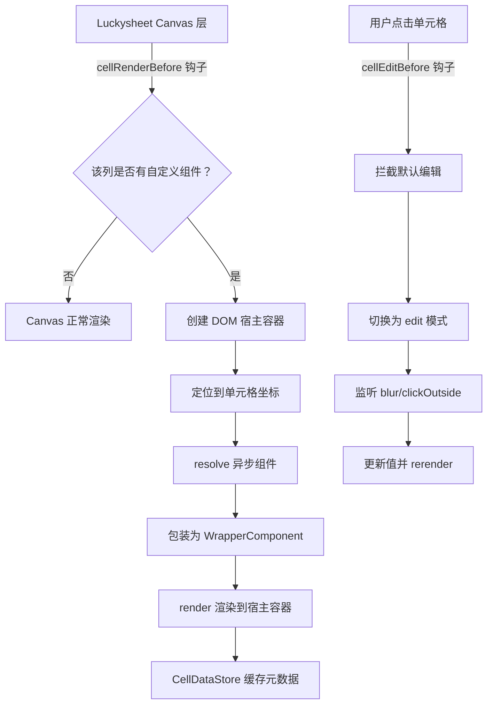
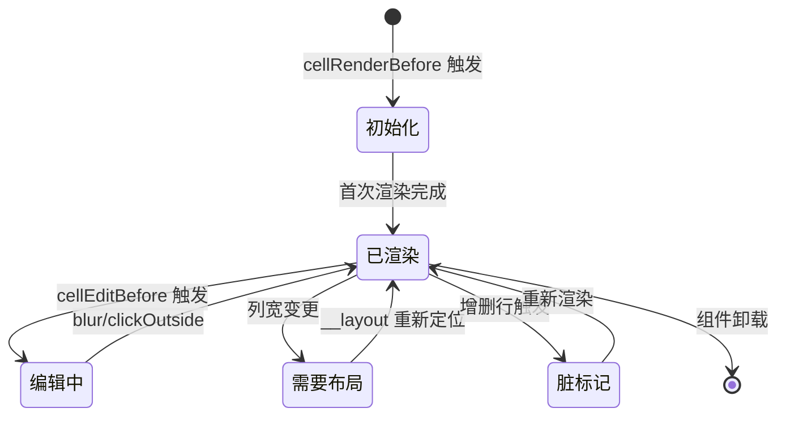
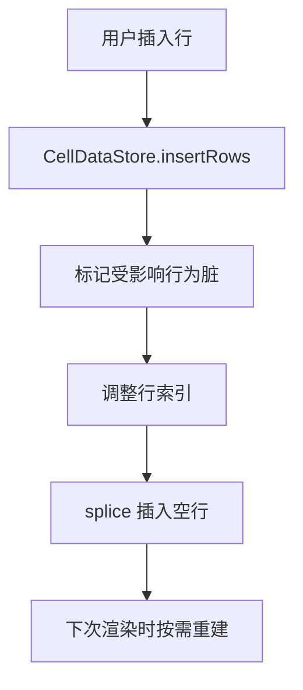
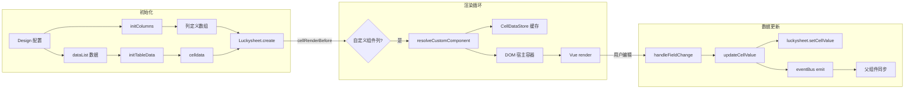

## 背景

在一些企业级 OA/审批系统中，表格往往不是简单的数据展示，而是承载着复杂表单能力的载体——某些列需要嵌入日期选择器、下拉框、甚至审批意见等多功能组件。传统表格组件（如 Element Plus Table）虽然灵活，但在处理大量行列时性能堪忧；而基于 Canvas 渲染的电子表格引擎（如 Luckysheet）性能极佳，却天然不支持 Vue 组件的嵌入。

DynamicTableRenderV2 组件就是在这个背景下诞生的：**它在 Luckysheet 的 Canvas 渲染层之上，搭建了一套 DOM 宿主容器体系，实现了「Canvas 表格 + Vue 动态组件」的混合渲染架构**。

---

## 整体架构



核心思路：**Canvas 负责网格线、普通文本、列标题等基础渲染；自定义组件通过绝对定位的 DOM 元素叠在 Canvas 上方，由 Vue 的 `render` 函数手动管理挂载和卸载**。

---

## 难点一：Canvas 与 DOM 的坐标对齐

Luckysheet 通过 Canvas 绘制单元格内容，每个单元格的渲染位置由 `CellPosition` 描述：

```typescript
interface CellPosition {
    c: number       // 列索引
    r: number       // 行索引
    start_c: number // 单元格左上角 x 坐标
    end_c: number   // 单元格右下角 x 坐标
    start_r: number // 单元格左上角 y 坐标
    end_r: number   // 单元格右下角 y 坐标
}
```

要将 Vue 组件精确叠在对应单元格上方，需要考虑三个偏移量：

```typescript
const createHostElement = (compoName: string, pos: CellPosition) => {
    const container = document.querySelector(
        `#${containerId} .luckysheet-cell-sheettable`
    )

    const scrollX = document.querySelector('#luckysheet-scrollbar-x')?.scrollLeft || 0
    const scrollY = document.querySelector('#luckysheet-scrollbar-y')?.scrollTop || 0

    const hostEl = document.createElement('div')
    hostEl.style.width  = `${pos.end_c - pos.start_c}px`
    hostEl.style.height = `${pos.end_r - pos.start_r}px`
    // 减去行号列/列标题高度，再加上虚拟滚动偏移
    hostEl.style.left = `${pos.start_c - rowHeaderWidth + scrollX}px`
    hostEl.style.top  = `${pos.start_r - columnHeaderHeight + scrollY}px`

    container.appendChild(hostEl)
    return hostEl
}
```

> 这里有个容易忽略的细节：Luckysheet 使用虚拟滚动，`cellRenderBefore` 回调中传入的坐标是绝对坐标，但 DOM 容器是相对于可视区域定位的，因此需要加上当前的滚动偏移量。而在后续的 `__layout` 方法中重新定位时，不需要再加滚动偏移（因为 Luckysheet 重新渲染时已经把坐标调整过了）。

---

## 难点二：单元格组件的完整生命周期管理

普通 Vue 组件由框架自动管理生命周期，但在这个场景中，组件的创建、更新、销毁全都需要手动控制。每个自定义单元格都被包装为一个 `CellMetaData` 对象，承载了完整的状态机：



对应的元数据结构：

```typescript
interface CellMetaData {
    originalValue: string | number
    r: number
    c: number
    mode: 'view' | 'edit'
    __hasRender: boolean
    __host: HTMLDivElement | null
    __component: any
    __compoName: string
    __renderKey: string
    __rerender?: (mode?: 'view' | 'edit') => Promise<CellMetaData>
    __reMount?: () => void
    __updater?: () => void
    __fieldInfo: any
    __shouldLayout: boolean
    __layout?: (pos: CellPosition) => void
}
```

这套设计让每个单元格都拥有了自描述、自更新的能力——通过 `targetCell.__rerender()` 可以在任意时刻将单元格切换为编辑模式或回退到查看模式，而无需外部维护复杂的组件引用映射。

---

## 亮点一：WrapperComponent 包装模式

为了让 Luckysheet 中挂载的 Vue 组件能正确读取全局上下文并响应数据变化，组件设计了一个精巧的包装层：

```typescript
const createWrapperComponent = (component, fieldInfo, targetCell) => {
    return defineComponent({
        setup() {
            const compoField = reactive(prepareField(fieldInfo, targetCell.originalValue?.toString()))
            const newGlobalData = Object.create(globalData)
            newGlobalData.fnGetField = () => compoField
            newGlobalData.persistChangedField = () => {}

            watch(compoField, (val) => {
                handleFieldChange(val, targetCell)
            })

            return () => h(component, {
                options: {
                    globalData: newGlobalData,
                    title: fieldInfo.fieldType?.Description,
                    mode: targetCell.mode ?? 'view',
                },
                key: targetCell.__renderKey,
            })
        }
    })
}
```

**关键设计点**：

1. **`Object.create(globalData)`**：基于原型链继承全局数据对象，避免污染原始数据
2. **`persistChangedField` 置空**：原组件中这个方法会触发全局的数据持久化流程，但在表格场景中不需要，用空函数替代以消除副作用
3. **`watch(compoField)`**：用 watch 监听字段变化替代原来的 `persistChangedField` 调用，将数据变更桥接到表格的 `updateCellValue` 流程
4. **`key: targetCell.__renderKey`**：通过变更 key 值强制组件重新渲染，实现 view/edit 模式切换

这种包装模式的好处是：**原始业务组件完全不需要感知自己运行在表格中**，它们只需要按照原有的 props 约定接收 `options.globalData` 即可正常工作。

---

## 亮点二：CellDataStore 脏标记机制

当用户在表格中插入或删除行时，所有后续行的索引都会发生变化。如果采用简单的清空重渲染策略，在数据量大时会有明显的性能问题。CellDataStore 采用了一种高效的**脏标记机制**：

```typescript
private markCellAsDirty(cellData: CellMetaData, rowChange?: RowChangeInfo): void {
    // 移除旧的 DOM 节点
    if (cellData.__host && cellData.__host.parentNode) {
        cellData.__host.parentNode.removeChild(cellData.__host)
    }
    // 清空缓存
    cellData.__host = undefined
    cellData.__component = undefined
    cellData.mode = 'view'
    cellData.__hasRender = false
    // 更新行索引
    if (rowChange) {
        cellData.r += rowChange.type === 'add'
            ? rowChange.count
            : -rowChange.count
    }
}
```



**核心优势**：只标记受影响的行（从操作位置开始的所有后续行），未受影响的行完全不受影响。脏单元格在 Luckysheet 下一次触发 `cellRenderBefore` 时会被重新识别并重建，实现了**延迟渲染**。

---

## 亮点三：输入型组件的延迟更新策略

不同类型的组件对数据更新的时机要求不同。例如文本输入框，用户在输入过程中不应该每次按键都触发数据回写；而下拉选择器则应该在选中后立即更新。

```typescript
export const compoNeedDelayUpdate = (name: string) => {
    return ['text', 'textarea', 'number', 'float', 'DealWithOpinion', ...].includes(name)
}
```

对于输入型组件：

```typescript
const handleFieldChange = (field, targetCell: CellMetaData) => {
    if (compoNeedDelayUpdate(field.Name)) {
        // 延迟更新：先缓存 updater，等 blur 时再执行
        targetCell.__updater = updateCellValue.bind(null, field, targetCell)
    } else {
        // 立即更新
        updateCellValue(field, targetCell)
    }
}
```

配合 `cellEditBefore` 钩子，在进入编辑模式时通过 `MutationObserver` 监听 input 元素的加载，待其出现后自动 focus 并绑定 blur 事件：

```typescript
const handleInputTypeComponentLoaded = (node, targetCell) => {
    observeTableCellElement(node, [
        ".el-input .el-input__inner",
        ".el-textarea .el-textarea__inner",
    ], (element) => {
        element.focus()
        preventEventsOf(element, ['mousedown', 'keydown'])
        element.addEventListener("blur", () => {
            clearTableCellElementObserver(node)
            targetCell.__updater?.() ?? targetCell.__rerender()
        })
    })
}
```

> `preventEventsOf` 的作用是阻止 `mousedown` 和 `keydown` 事件冒泡到 Luckysheet，避免触发其内置的快捷键行为（如方向键移动选区）和鼠标选中行为。

对于非输入型组件，则使用 `onClickOutside` 来触发模式回退：

```typescript
const handleOtherTypeComponentLoaded = (node, targetCell) => {
    const cancel = onClickOutside(node, () => {
        if (targetCell.mode !== 'edit') return
        targetCell.__rerender()
        cancel()
    }, { ignore: ['.el-popper'] })
}
```

---

## 难点三：复制粘贴的自定义处理

Luckysheet 默认的复制粘贴只能处理纯文本，而自定义单元格中存储的是带有 `ValueType` 描述的 JSON 结构（如 `{ ValueType: "ValueString", ValueString: "hello" }`）。因此需要完全重写 copy/paste 逻辑：

```typescript
const handleCopy = (e) => {
    const [range] = luckysheet.getLuckysheetfile()[0].luckysheet_select_save
    const [startRow, endRow] = range.row
    const [startCol, endCol] = range.column
    let content = ''
    for (let i = startRow; i <= endRow; i++) {
        for (let j = startCol; j <= endCol; j++) {
            content += (luckysheet.getCellValue(i, j) || '') + '\t'
        }
        content += '\r\n'
    }
    e.clipboardData.setData('text/plain', content)
    e.preventDefault()
}
```

粘贴时需要解析粘贴的内容，并通过 `updateCellValue` 更新目标单元格的 JSON 结构：

```typescript
const handlePaste = (e) => {
    const pastedData = e.clipboardData.getData('text/plain')
        .split('\r\n').map(row => row.split('\t'))

    for (let i = startRow; i <= endRow; i++) {
        for (let j = startCol; j <= endCol; j++) {
            const targetCell = globalCellData.get(i, j)
            if (targetCell) {
                const val = JSON.parse(targetCell.originalValue)
                val[val.ValueType] = pastedData[i - startRow][j - startCol]
                updateCellValue(val, targetCell)
                targetCell.__reMount()
            }
        }
    }
}
```

---

## 难点四：列标题的 Canvas 自绘

Luckysheet 的列标题也是 Canvas 渲染的，默认只显示列号（A、B、C...）。但业务需要显示实际的字段名称，因此需要通过 `columnTitleCellRenderAfter` 钩子在 Canvas 上手动绘制文字：

```typescript
const handleColumnTitleRenderAfter = (cellValue: string, pos, ctx) => {
    const title = columns[pos.c].title
    ctx.clearRect(pos.left, 0, pos.width - 1, pos.height - 1)
    ctx.font = '14px Arial, sans-serif'
    ctx.fillStyle = '#000000'
    ctx.textAlign = 'left'
    ctx.textBaseline = 'middle'
    ctx.fillText(title, pos.left + 5, pos.height / 2)
}
```

---

## 数据流转全景



---

## 总结

DynamicTableRenderV2 的构建过程中，最核心的挑战在于**在两个完全不同的渲染体系（Canvas 与 Vue DOM）之间建立桥接**。回顾整个方案：

| 技术点 | 方案 |
|--------|------|
| Canvas 上叠加 Vue 组件 | 绝对定位 DOM 宿主容器 + `render()` 手动挂载 |
| 组件生命周期管理 | `CellMetaData` 状态机 + `__rerender`/`__reMount` 方法 |
| 行列增删同步 | `CellDataStore` 脏标记 + 延迟重建 |
| 编辑模式切换 | `cellEditBefore` 拦截 + blur/clickOutside 监听 |
| 数据双向绑定 | `WrapperComponent` 包装 + `watch` 桥接 |
| 复制粘贴 | 重写 copy/paste 事件 + JSON 值解析 |
| 输入防抖 | `compoNeedDelayUpdate` 分类 + blur 触发 |

这套方案的本质是一个**微型的组件运行时**：它在 Luckysheet 的 Canvas 世界中开辟出了一片 DOM 飞地，用 Vue 的渲染函数作为胶水，让业务组件以为自己运行在一个普通的 Vue 应用中，而完全不需要感知底层是 Canvas 表格。
