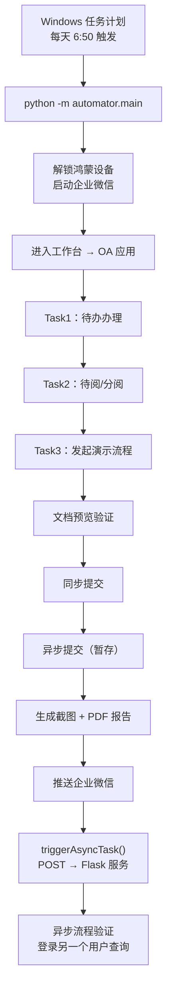

企业级 OA 系统的自动化测试有一个核心难题：你要验证的不只是"用户操作没有报错"，而是"操作之后业务数据真的生效了"。在一个流程从发起到归档的完整链路中，涉及同步提交、异步提交、文件预览、人员选择等多个环节，任何一步出问题都会导致流程卡死。

本文记录了我为 OA 系统搭建的一套完整的自动化测试方案。这套方案每天早上 6:50 由 Windows 任务计划自动触发，在鸿蒙设备上通过企业微信完成：待办办理、待阅查阅、流程发起（含同步提交和异步提交）、文档预览验证、流程流转等操作，并在每一步进行截屏。测试结束后自动生成 PDF 报告推送至企业微信，同时对异步提交的结果进行二次验证。

---

## 一、完整链路概览

### 每日自动测试的全景



整个链路涉及两个独立的 Python 项目：

```
automatic-mobile/              # 主测试项目（鸿蒙设备自动化）
├── main.py                    # WeWorkAutomator 主类，编排全部测试流程
├── jobHelper.py               # JobHelper 任务执行引擎 + locate 定位器
├── ocrHelper.py               # PaddleOCR 文字识别
├── config.py                  # 元素选择器配置 + 业务配置
├── reportHelper.py            # 截图 → PDF → 企业微信文件推送
├── messageHelper.py           # 企业微信消息通知
├── asyncTrigger.py            # 测试结束后触发异步验证
├── scheduleHelper.py          # 值班人员排班表读取
├── checkConnection.py         # 鸿蒙设备连接状态监控
├── utils.py                   # 工具函数
├── input/                     # 排班表、报告样式等静态资源
├── output/YYYY-MM-DD/         # 每日输出：截图、PDF、录像
└── plugins/wkhtmltox/         # PDF 生成工具

test_oa_asyncjob/              # 异步验证服务（Flask）
├── main.py                    # Flask Webhook 路由
├── oaHelper.py                # OA 登录 + 流程查询
├── taskHelper.py              # 失败重试（Windows 任务计划）
├── messageHelper.py           # 企业微信消息
├── config.py                  # OA 账号配置
└── guard.bat                  # Flask 服务守护脚本
```

---

## 二、鸿蒙设备驱动：hmdriver2 + 多策略定位

### 为什么选择 hmdriver2

传统移动端自动化测试通常基于 Appium，但 Appium 对鸿蒙系统的支持有限。我们使用的是 `hmdriver2`——一个专为鸿蒙设备设计的自动化驱动框架，通过 HDC（HarmonyOS Device Connector）协议与设备通信。

```python
from hmdriver2.driver import Driver

class WeWorkAutomator:
    def __init__(self):
        self.d = Driver("<DEVICE_SERIAL>")  # 固定设备序列号
```

它提供了我们需要的全部能力：XPath 元素定位、坐标点击、文本输入、滑动操作、截图、录屏。

### 三种定位策略

OA 系统通过企业微信内置浏览器加载 WebView 页面，元素的可访问性层次参差不齐——有些按钮有稳定的 XPath，有些文本只能通过 OCR 识别，有些区域干脆只能靠坐标点击。为此我在 `locate` 函数中实现了三种定位策略的统一调度：

```python
def locate(d, locator):
    selectorType = locator.get("type", None)
    click = locator.get("defaultClick", True)

    if selectorType == "xpath":
        el = d.xpath(locator["value"])
        if el.exists():
            if click: el.click()
            return el.info
        return False

    elif selectorType == "position":
        x, y = locator["value"]
        d.click(x, y)
        return True

    elif selectorType == "ocr":
        target = locator["value"]
        which = locator.get("which")
        multiple = which is not None

        imgPath = "{}/{}.jpg".format(config.TEMP_DIR, time())
        d.screenshot(imgPath)
        res, positions = textInPic(imgPath, target, multipleReturn=multiple)

        if not res: return False

        if multiple:
            for x, y in positions:
                if which(x, y):
                    if click: d.click(x, y)
                    return (x, y)
        else:
            x, y = positions[0]
            if click: d.click(x, y)
            return (x, y)
        return False
```

**策略一：XPath 精确定位**

适用于企业微信原生控件和 WebView 中可访问性良好的元素：

```python
"OA-Tab待办": {
    "type": "xpath",
    "value": '//*[contains(@text, "待办") and @type="link"]',
}
```

**策略二：坐标定位**

当元素既没有稳定的 XPath，也无法通过 OCR 识别时，只能硬编码坐标：

```python
"浏览器-OA-发起流程-演示流程发起按钮": {
    "type": "position",
    "value": [0.86, 0.28],
}
```

使用相对坐标（0-1 范围）而非绝对像素值，以适配不同分辨率。

**策略三：PaddleOCR 文字识别定位**

这是最灵活也最关键的策略。当 WebView 中的元素没有可访问性属性，但页面上有明确的文字标识时，OCR 定位就派上用场了：

```python
"task3-演示流程-点击待办第一个待办": {
    "type": "ocr",
    "value": self.FLOW_TITLE.replace(" ", ""),
    "which": lambda x, y: y > 620,
}
```

`which` 参数是一个过滤函数——当屏幕上存在多个匹配文本时，通过坐标条件筛选出目标。比如这里 `y > 620` 表示只取屏幕下半部分的匹配项，避免误点击搜索框中的文本。

### PaddleOCR 的集成

```python
from paddleocr import PaddleOCR

ocr = PaddleOCR(
    use_doc_orientation_classify=False,
    use_doc_unwarping=False,
    use_textline_orientation=False,
)

def textInPic(path, text, *, writeResult=True, writePath=TEMP_DIR, multipleReturn=False):
    result = ocr.predict(path)[0]
    res = result.json["res"]
    resultList = []

    for i, s in enumerate(res["rec_texts"]):
        if text in s:
            lt, rt, rb, lb = res["rec_polys"][i]
            originX = lt[0] + (rt[0] - lt[0]) / 2
            originY = lt[1] + (lb[1] - lt[1]) / 2
            resultList.append([originX, originY])
            if not multipleReturn:
                break

    return (True, resultList) if resultList else (False, [])
```

关键设计：
- 禁用了文档方向分类、文档去弯曲、文本行方向检测——这些功能会显著增加识别耗时，而我们的场景是固定竖屏截图，不需要这些预处理
- `rec_polys` 返回的是文字区域的四边形坐标，取对角线交点作为点击中心，比取左上角更精准
- `multipleReturn` 支持返回所有匹配位置，配合 `which` 过滤函数实现多目标筛选

---

## 三、JobHelper：声明式的任务编排引擎

### 设计思路

一个完整的测试流程由几十个步骤组成：点击 Tab → 等待加载 → 点击列表项 → 等待详情 → 点击办理 → 等待结果。如果每一步都手写"定位 → 等待 → 截图 → 下一步"，代码会膨胀到难以维护。

我设计了 `JobHelper`——一个声明式的任务编排引擎，将每个步骤抽象为一个 Job 对象：

```python
jh = JobHelper(self.d, [
    {
        "jobName": "task1-待办列表",
        "locator": self.ELE_SELECTOR["OA-Tab待办"],
        "useCapture": True,
    },
    {
        "jobName": "task1-待办详情",
        "locator": self.ELE_SELECTOR["OA-待办页-第一个待办"],
        "useCapture": True,
    },
    {
        "jobName": "task1-待办办理",
        "locator": self.ELE_SELECTOR["OA-待办详情-办理按钮"],
        "useCapture": True,
        "after": lambda res, isLast: self.changeState(),
    },
])
jh.run()
```

每个 Job 支持以下配置：

| 字段 | 作用 | 默认值 |
|------|------|--------|
| `jobName` | 任务名称（用于截图命名和日志输出） | "未命名" |
| `locator` | 定位器（支持 xpath/ocr/position 三种类型） | 必填 |
| `useCapture` | 定位成功后是否截图 | False |
| `waitTime` | 定位后的等待时间（秒） | 8 |
| `noWait` | 跳过等待 | False |
| `useStrict` | 严格模式：定位失败时抛异常 | True |
| `fallback` | 定位失败时的降级函数 | None |
| `after` | 定位成功后的回调函数 | None |
| `prev` | 定位前的前置操作 | None |

### 执行流程

```python
class JobHelper:
    def run(self):
        for index, job in enumerate(self.jobList):
            self.prevAction(job)       # 前置操作
            res = self.locate(job)     # 定位（调用 locate 函数）
            if useStrict and not res:  # 严格模式 + 失败
                fallback = job.get("fallback", None)
                if fallback:
                    fallback()
                    break
                else:
                    raise Exception(f"定位任务{jobName}执行失败，详情请查看录像回放")
            else:
                self.postAction(job, locateResult=res, isLast=...)  # 后置操作（截图、回调）
```

`after` 回调接收两个参数：`locateResult`（定位结果）和 `isLast`（是否是最后一个 Job）。这让回调函数可以根据定位结果做动态处理。比如在 OCR 定位到人员选择框后，根据返回的坐标计算偏移位置来点击选中项：

```python
"after": lambda res, isLast: confirmSelect(res)

def confirmSelect(res):
    (x, y) = res
    self.d.click(x + 476.5, y - 111)  # 通过偏移量点击目标选中项
```

### fallback：优雅的降级

有些步骤不是必须成功的。比如在会签人员选择时，如果搜索结果为空，可以跳过这个步骤继续后续流程。`fallback` 机制提供了这种灵活性：定位失败时执行降级函数并中断后续 Job，而不是直接抛异常导致整个测试中断。

---

## 四、三段式测试流程

### Task 1：待办办理

进入 OA 应用后，点击"待办"Tab，打开第一个待办事项，点击"办理"按钮完成办理。

```python
def pendingWorkFlowList(self):
    jh = JobHelper(self.d, [
        {"jobName": "task1-待办列表", "locator": ..., "useCapture": True},
        {"jobName": "task1-待办详情", "locator": ..., "useCapture": True},
        {"jobName": "task1-待办办理", "locator": ..., "useCapture": True,
         "after": lambda res, isLast: self.changeState()},
    ])
    return jh.run()
```

`changeState` 在办理完成后返回上级页面，并将状态计数器推进到下一个任务。

### Task 2：待阅/分阅

点击"分阅"Tab，查看"已阅"分栏，打开第一个待阅项。

### Task 3：发起演示流程（核心）

这是最复杂的任务，包含多个阶段：

**阶段一：跳转到浏览器发起流程**

企业微信的 WebView 限制了部分功能，因此测试流程通过企业微信消息对话框发送一个 OA 系统的 URL，然后点击该链接跳转到外部浏览器中操作：

```python
def createWorkFlow(self):
    jh = JobHelper(self.d, [
        {"jobName": "点击消息Tab", ...},
        {"jobName": "点击消息列表-第一个消息", ...},
        {"jobName": "点击消息对话-输入框", ...,
         "after": lambda res, isLast: inputMessage()},  # 输入 URL
        {"jobName": "点击消息对话-发送按钮", ...},
        {"jobName": "点击消息对话-点击链接", "defaultClick": False,
         "after": lambda res, isLast: manualClick(res)},  # 计算坐标点击
    ])
```

这里有个细节：链接元素设置了 `"defaultClick": False`，因为 WebView 中的链接点击行为不可靠。改为通过 `after` 回调获取元素坐标，手动计算偏移位置后点击。

**阶段二：搜索并发起流程**

在浏览器中打开 OA 的流程发起页面，选择分类、搜索流程模板、点击发起：

```python
def browserFindFlow(self):
    jh = JobHelper(self.d, [
        {"jobName": "task3-发起流程分类按钮", ..., "after": selectAllCate},
        {"jobName": "task3-发起流程搜索框", ..., "after": inputFlowName},
        {"jobName": "task3-点击搜索按钮", ...},
        {"jobName": "task3-校验搜索结果", ..., "useCapture": True},
        {"jobName": "task3-发起演示流程", ..., "useCapture": True,
         "after": lambda res, isLast: self.oldBrowserFlowProcess()},
    ])
```

输入流程名称后有一个校验机制——检查搜索框中是否确实包含了输入的文本，如果输入失败则递归重试（最多 3 次）：

```python
def inputFlowName(retryTimes=0):
    self.d.input_text(self.EXTRA_INFO["流程搜索关键词"])
    r = locate(self.d, self.ELE_SELECTOR["浏览器-OA-发起流程-输入结果"])
    if not r:
        if retryTimes < 3:
            inputFlowName(retryTimes + 1)
        else:
            raise Exception("输入流程名称失败")
```

**阶段三：填写表单并暂存（异步提交）**

流程标题使用时间戳 + 随机字符生成，确保每次测试的流程标题唯一，方便后续查询：

```python
def inputFileName():
    title = datetime.now().strftime("%m-%d-%H-%M")
    self.FLOW_TITLE = "测试{}-{}".format(
        title, "".join(random.sample("abcdefghijkmnpqrstuvwxyz", 3))
    )
    self.d.input_text(self.FLOW_TITLE)
```

点击"暂存"按钮进行异步提交，然后返回工作台。

**阶段四：文档预览验证**

回到 OA 应用后，搜索刚创建的流程，进入办理页面。首先验证文档是否正确加载——通过 XPath 定位到 `.docx` 文件名，点击进入预览：

```python
{"jobName": "task3-演示流程-文件预览",
 "locator": {"type": "xpath",
             "value": f"//*[@text='{self.FLOW_TITLE}.docx']"},
 "useCapture": True},
```

进入预览页面后，通过 OCR 识别文档中的特定标识文字来确认文档确实加载成功：

```python
"文档预览-校验": {
    "type": "ocr",
    "value": "<文档标识文字>",
    "defaultClick": False,
}
```

**阶段五：同步提交 + 会签人员选择**

验证完文档预览后，返回办理页面进行同步提交。提交后需要再次进入同一流程，选择会签人员并完成最终提交：

```python
# 同步提交
def syncSubmit(res):
    locate(self.d, self.ELE_SELECTOR["OA-待办页面校验"])
    self.d.screenshot(f"{config.OUTPUT_DIR}/task3-待办页面同步提交.jpg")
    while not locate(self.d, self.ELE_SELECTOR["浏览器-OA-演示流程-提交"]):
        sleep(self.WAIT_TIME["SHORT"])
        self.d.swipe_ext("up")  # 向下滑动查找提交按钮
```

会签人员选择是一个精巧的操作——搜索框使用 OCR 定位（因为 WebView 中输入框没有可访问性属性），选中人员后通过坐标偏移点击确认：

```python
def confirmSelect(res):
    (x, y) = res
    self.d.click(x + 476.5, y - 111)  # 通过偏移量点击复选框
    locate(self.d, self.ELE_SELECTOR["OA-演示流程-办理人-确定按钮"])
```

---

## 五、测试报告：截图 → PDF → 企业微信推送

### 全流程截屏

在 `JobHelper` 中，每个标记了 `useCapture: True` 的 Job 在定位成功后都会自动截图。同时主流程还开启了录屏：

```python
with automator.d.screenrecord.start(f"{config.OUTPUT_DIR}/screenrecord.mp4"):
    automator.run()
```

### 生成 PDF 报告

测试结束后，`reportHelper` 将当天所有截图按时间排序，通过 wkhtmltopdf 生成 PDF 报告：

```python
def mergeImgToPdf(pdfName="report.pdf", account=""):
    # 遍历 output 目录，按文件创建时间排序
    imgOpenList = []
    for file in sorted(os.listdir(cfg.OUTPUT_DIR),
                       key=lambda x: os.path.getctime(os.path.join(cfg.OUTPUT_DIR, x))):
        if file.lower().endswith((".jpg", ".jpeg")):
            abs_path = os.path.abspath(os.path.join(cfg.OUTPUT_DIR, file))
            file_url = f"file:///{abs_path.replace('\\', '/')}"
            imgOpenList.append({"name": file, "url": file_url})

    # 构建包含图片的 HTML，转为 PDF
    html_content = f"""
    <h1>OA自动化测试报告</h1>
    <div>测试账号：{account}</div>
    <div>测试时间：{cfg.RUNNING_DATE}</div>
    {''.join([f'' for img in imgOpenList])}
    """
    pdfkit.from_string(html_content, output_pdf, configuration=config)
```

### 企业微信推送

PDF 报告通过企业微信 API 上传并发送到群聊：

```python
def sendReport(status="执行成功", reason="无异常信息", account=""):
    pdfPath = mergeImgToPdf(account=account)
    media_id = uploadFile(pdfPath)     # 上传 PDF 获取 media_id
    sendMsg(status=status, reason=reason)  # 发送文本消息
    sendFile(media_id)                 # 发送 PDF 文件
```

---

## 六、异步验证服务：从"操作成功"到"业务成功"

### 问题

测试脚本执行了"暂存"（异步提交）操作，但 OA 系统的异步提交流程需要经过后端消息队列处理后才会真正创建流程实例。测试脚本无法在执行过程中验证这一步——因为它是异步的。

### 方案：Flask Webhook + OA API

测试脚本结束时，无论成功还是失败，都会通过 `asyncTrigger` 向本机的 Flask 服务发送请求：

```python
# automatic-mobile/asyncTrigger.py
def triggerAsyncTask(exitCode, flowTitle):
    try:
        requests.post("http://127.0.0.1:5000/trigger",
                      json={"exitCode": exitCode, "flowName": flowTitle})
    except Exception as e:
        print("触发异步任务失败：{}".format(e))
```

Flask 服务根据 exitCode 分发处理：

```python
# test_oa_asyncjob/main.py
@app.route("/trigger", methods=["POST"])
def trigger():
    jsonData = request.get_json()
    exitCode = jsonData.get("exitCode")
    flowName = jsonData.get("flowName")
    if exitCode != 0:
        return retryTask() or "none"   # 测试失败 → 自动重试
    sleep(40)                           # 等待异步提交完成
    return checkFlowAndReport(flowName) # 验证异步结果
```

验证逻辑是登录 OA 系统的另一个预设用户，调用流程搜索接口查看是否收到了该流程：

```python
def checkFlowExist(flowName: str) -> tuple[bool, str]:
    token = auth()  # 登录另一个用户
    resp = requests.post(UINFO["queryFlowUrl"],
        json={"flowName": flowName, "page": 1, "rows": 10},
        headers={"authorization": token})
    rows = resp.json().get("rows", [])
    for row in rows:
        if row["flow"] == flowName:
            return (True, f"检测到流程：{flowName}\n发起人：{row['owner']}")
    return (False, f"未检测到流程：{flowName}，异步提交可能未成功")
```

### 失败时的自愈重试

当 exitCode ≠ 0（测试脚本本身失败）时，Flask 服务会通过 `schtasks` 命令重新触发 Windows 任务计划来重跑测试，同时通过文件计数器控制最大重试次数：

```python
def retryTask(task_name="OA自动化测试任务-M", retry_count=2):
    logFile = os.path.join(getOutputDir(), f"{task_name}.log")
    # 文件不存在 → 创建，写入 "1"
    # 读取文件 → 获取重试次数
    # 超过上限 → 放弃
    # 未超过 → schtasks /run 触发重试，计数器 +1
    sendAnyMsg(f"🫢看起来上次任务执行失败了，我将进行第{tryTime}次重试")
    res = runTask(task_name)
```

日志文件按日期隔离，存放在 `output/YYYY-MM-DD/` 目录下，每天的重试计数器独立。

### 服务守护

Flask 服务通过 `guard.bat` 保持常驻。脚本具有幂等性——先检查端口是否已被占用，如果已占用则跳过启动：

```bat
netstat -ano | findstr ":5000 " | findstr "LISTENING" > nul
if !errorlevel! equ 0 (
    exit /b 0
)
start /B /MIN "FlaskApp" flask --app main run
```

---

## 七、设备连接监控

测试依赖鸿蒙设备通过 USB 连接。设备断连是偶发事件（USB 线松动、设备休眠等），如果不及时发现，第二天早上的定时任务就会失败。

`checkConnection.py` 实现了一个独立的监控进程，每小时检测一次设备连接状态，断连时自动尝试重连并通知企业微信：

```python
class DeviceConnectionChecker:
    def check_device_connected(self):
        stdout, stderr, returncode = self.run_command("hdc list targets")
        return self.device_addr in stdout

    def connect_device(self):
        for attempt in range(1, self.max_retries + 1):
            time.sleep(5)
            if self.check_device_connected():
                sendAnyMsg(f"✅ 设备重新连接成功，重试次数：{attempt}")
                return True
        sendAnyMsg("❌ 设备重连失败，请检查设备连接或USB线缆！")
```

还考虑了静默时段——23:30 到 5:30 之间不发消息打扰，改为写入日志文件。

---

## 八、亮点与难点总结

### 亮点设计

| 设计点 | 实现方式 | 效果 |
|--------|---------|------|
| 三策略定位 | XPath + 坐标 + PaddleOCR | 适配 WebView 各种可访问性层次 |
| 声明式任务引擎 | JobHelper + Job 配置对象 | 几十步测试流程代码清晰可读 |
| 录屏 + 关键步骤截图 | hmdriver2 screenrecord + useCapture | 失败时可回放完整操作过程 |
| 异步验证闭环 | Flask Webhook + OA API | 验证异步提交是否真正生效 |
| 自愈重试 | 文件计数器 + schtasks | 测试失败时自动恢复 |
| PDF 报告自动推送 | wkhtmltopdf + 企业微信文件上传 | 团队每天早上收到完整测试报告 |
| 设备监控 | hdc 连接检测 + 静默时段 | 设备断连第一时间发现并恢复 |
| 唯一流程标题 | 时间戳 + 随机字符 | 避免不同日期的测试数据互相干扰 |

### 核心难点

1. **WebView 元素定位**：企业微信内嵌 WebView 的可访问性层次极不统一，同一个页面的不同元素可能需要分别用 XPath、OCR、坐标三种策略来定位
2. **异步等待窗口期**：OA 异步提交没有回调，需要权衡等待时间和验证可靠性，最终选择 40 秒固定等待
3. **会签人员选择**：人员搜索框没有可访问性属性，只能 OCR 定位；选中项没有独立的可点击区域，需要通过坐标偏移计算来点击
4. **跨应用切换**：从企业微信 WebView 跳转到浏览器发起流程，再跳回来搜索流程，中间涉及多次页面返回和状态恢复
5. **GBK 编码处理**：Windows 命令行工具 `schtasks` 输出 GBK 编码，Python 需要显式指定编码并忽略异常字符

---

## 总结

这个自动化测试项目的核心价值在于：**它验证的不是"操作过程没有报错"，而是"从发起到归档的完整业务链路全部通过"。** 待办能办理、待阅能查阅、流程能发起、文档能预览、同步提交能通过、异步提交能生效——每一步都有截图为证。

整个系统由两个松耦合的项目组成：`automatic-mobile` 负责在鸿蒙设备上执行测试并生成报告，`test_oa_asyncjob` 负责验证异步提交结果和失败重试。两者通过 HTTP 接口通信，各自独立运行、独立部署。

自动化测试的价值不在于"跑起来了"，而在于"跑出来的结果可信"。而结果可信的前提，是你验证了那条从用户操作到业务生效的完整链路。
